# 1024:10 Priority Encoder from RTL to GDSII using open-source VLSI tools

Welcome to the 1024:10 Priority Encoder physical design project! This repository documents the complete journey of a massive 1024-input digital macro, from behavioral Verilog code to a fully routed, timing-closed, and manufacturing-ready GDSII layout.

This project tackles significant physical design challenges—such as pad-limited pin congestion and high-fanout RC delays—using a hierarchical RTL architecture and aggressive physical resizer optimizations. It was built entirely using the open-source EDA toolchain provided by OpenLane, targeting the SkyWater 130nm (Sky130) Process Design Kit (PDK).

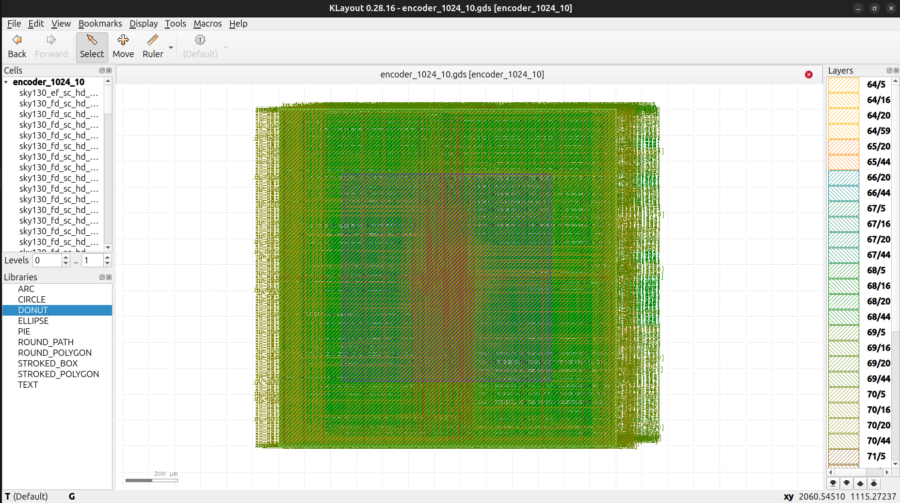

## 🛠️ Tools & Technologies

* **Process Node:** SkyWater 130nm (sky130A)
* **Logic Simulation:** Icarus Verilog (iverilog) & GTKWave
* **Synthesis:** Yosys & abc
* **Floorplanning, Placement & CTS:** OpenROAD
* **Routing:** FastRoute (Global) & TritonRoute (Detailed)
* **Physical Verification (DRC/LVS):** Magic & Netgen
* **Static Timing Analysis (STA):** OpenSTA
* **Layout Viewer:** KLayout / Magic

---

## 📖 The RTL-to-GDSII Flow & Visual Journey

Here is a step-by-step breakdown of the automated pipeline execution, accompanied by visual evidence from the project generated via OpenROAD and KLayout.

### 1. RTL Design & Functional Verification
To prevent catastrophic routing bottlenecks at the center of the die, the design avoids a flat architecture. Instead, it utilizes a **hierarchical divide-and-conquer approach**, splitting the 1024 inputs across four localized 256:8 sub-modules, tied together by a top-level wrapper. 

The logic was rigorously verified for exact priority resolution using directed testbenches before hitting synthesis.

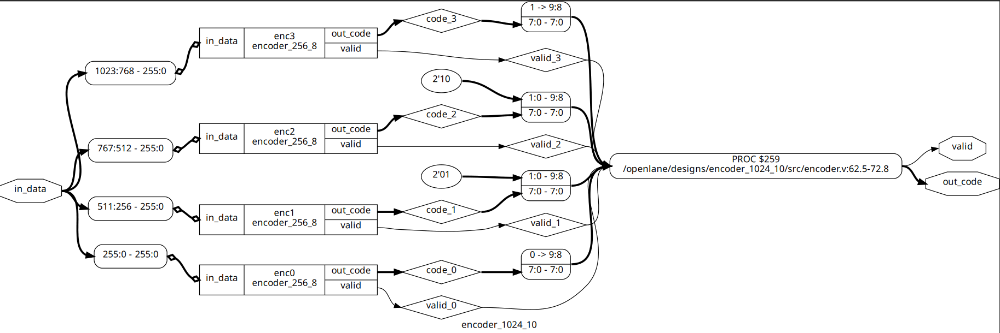
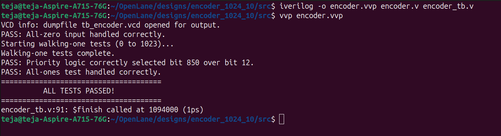

### 2. Logic Synthesis
The Verilog code is mapped to standard cells from the Sky130 library using Yosys. The synthesizer aggressively optimizes the combinational logic into a gate-level netlist prioritizing speed (`DELAY 1`).

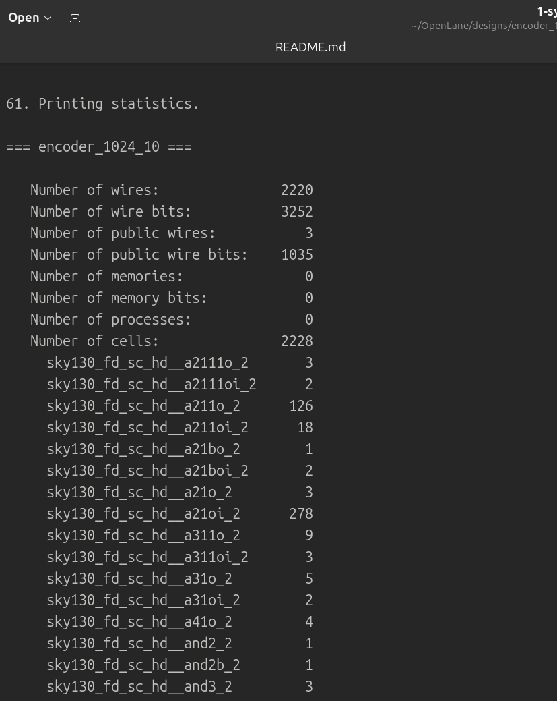

### 3. Floorplanning & Power Delivery Network (PDN)
A major challenge in a 1024-input macro is pin congestion (being Pad-Limited). To ensure the 1,035 I/O pins do not violate minimum metal spacing rules, the die area was expanded to **1300µm x 1300µm**. Following this, the robust metal grid of VDD and GND stripes was generated to power the core evenly.

> **NOTE:** You can view the `.odb` files in your results for floorplan/placement/routing using OpenROAD.
> **Steps to view `.odb` files:**
> 1. Open the OpenLane docker container using `make mount`
> 2. Navigate to the run path using `cd /path/to/results`
> 3. Run `openroad -gui`
> 4. In the OpenROAD window, run the TCL command: `read_db your_file_name.odb`

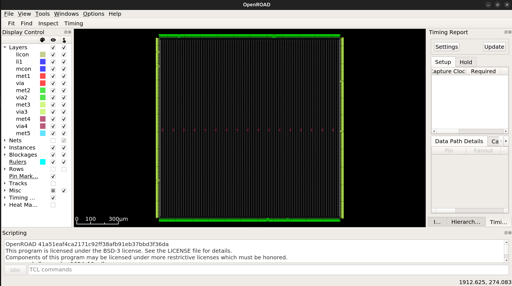
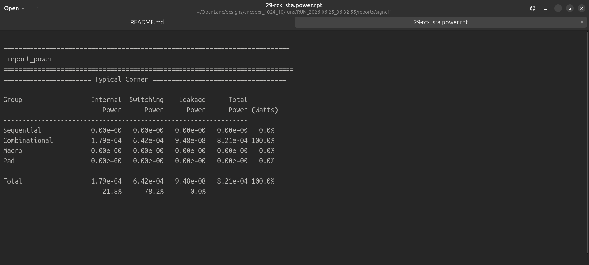

### 4. Placement
OpenROAD assigns physical locations to the 2,200+ synthesized standard cells inside the defined core area. Target density was lowered to allow ample routing channels between logic islands.

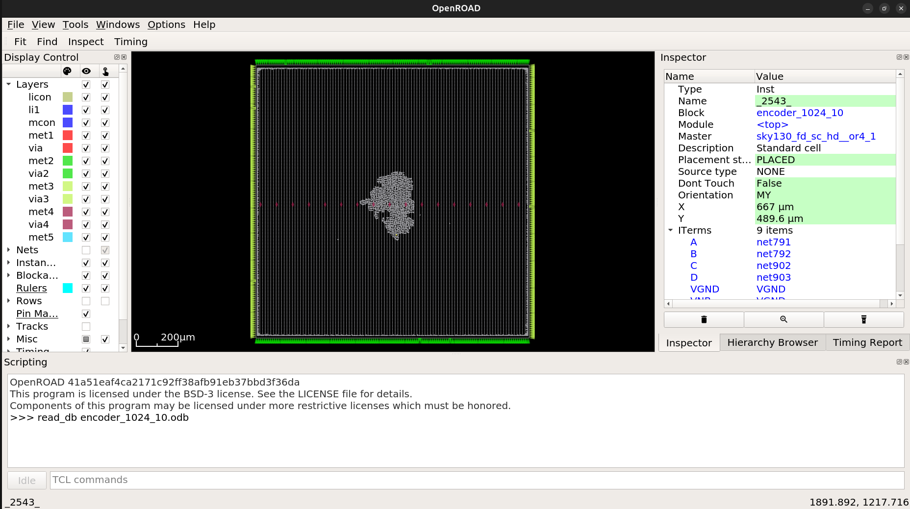

### 5. Routing & Timing Closure
Routing 1,024 inputs across a 1.3mm die introduces massive RC delays and slew violations. By enabling OpenROAD's physical resizers (`PL_RESIZER` and `GLB_RESIZER`), buffer trees were dynamically inserted during placement and routing to push signals across the die, successfully closing timing with zero setup violations.

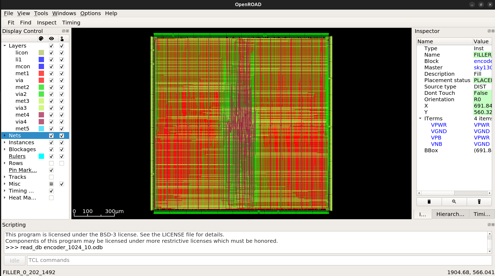
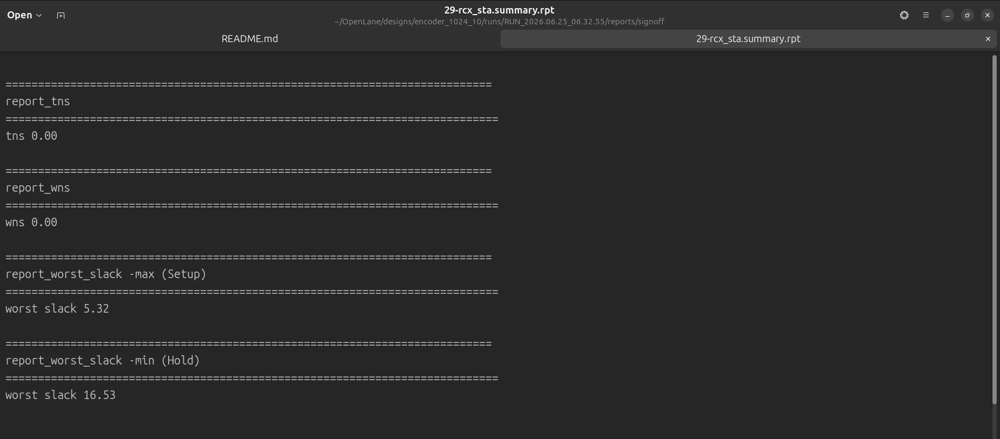

### 6. Signoff & Final Layout (GDSII)
The final and most crucial step. The design underwent strict physical and electrical verification (DRC, LVS, and Antenna checks) to ensure manufacturability. 

The final exported blueprint is `encoder_1024_10.gds`, visualized below:

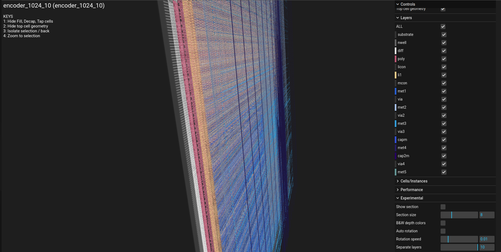
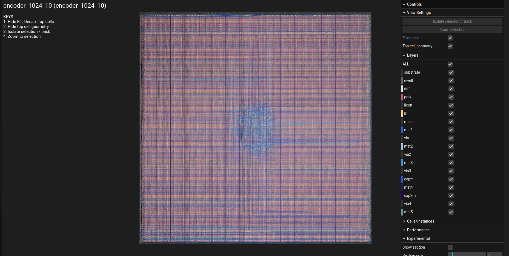

---

## 📁 Repository Structure

```text
├── encoder_ss/          # Visuals, screenshots, and reports for documentation
├── final/               # Final GDSII layout, LEF, and signoff files
├── floorplan/           # Def/Odb files from the floorplanning stage
├── placement/           # Def/Odb files from the placement stage
├── reports/             # Area, timing, power, and DRC/LVS signoff reports
├── src/                 # Verilog source codes and testbenches
├── synthesis/           # Synthesized gate-level netlists and statistics
├── README.md            # Project documentation
├── config.json          # OpenLane physical design configuration parameters
└── encoder_1024_10.zip  # Compressed package of the final GDS release
```

## 🚀 How to Reproduce

Want to build this chip on your own machine? 

**Prerequisites:**
* Linux OS (Ubuntu recommended)
* [OpenLane](https://github.com/The-OpenROAD-Project/OpenLane) installed via Docker
* Sky130 PDK configured

### Step 1: RTL Simulation
Test the logic before synthesizing:

```bash
# Compile the hierarchical design and testbench
iverilog -o tb_encoder src/encoder_1024_10.v src/tb_encoder_1024_10.v

# Execute the simulation
vvp tb_encoder

# View Waveforms
gtkwave tb_encoder.vcd
```

# 1. Mount the OpenLane Docker environment
```
make mount
```

# 2. Run the automated physical design pipeline
```
./flow.tcl -design encoder_1024_10
```

# 🤝 Acknowledgments

Special thanks to the open-source silicon community, the OpenROAD project, and Google/SkyWater for making these powerful tools and PDKs freely available for learning and innovation.
